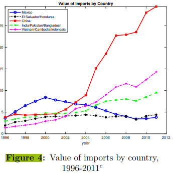
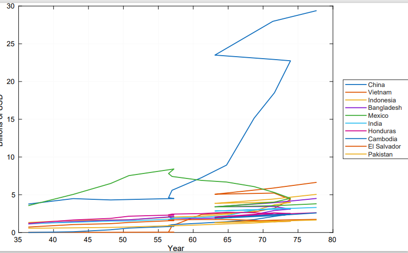
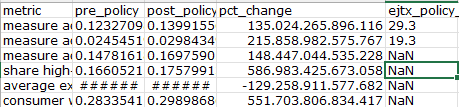
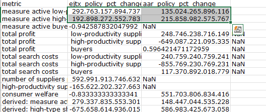
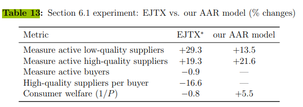

# Paper Identification

|  |   |
| ---  |  -------|
| ID  |   |
| Author  |   |
| Title  |   |
| Iteration |   |


Some useful information up front:

- [JPE Data and Code Availability Policy](https://www.journals.uchicago.edu/journals/jpe/datapolicy)
- [Step by step guidance from Data Editor for Authors](https://jpedataeditor.github.io/) 
- [Template README](https://social-science-data-editors.github.io/template_README/)


# Summary


In assessing compliance with our [Data and Code Availability Policy](https://www.journals.uchicago.edu/journals/jpe/datapolicy), our reproducibility team has identified the following issues, which we ask you to address:

1. Data Editor's first point.
2. Data Editor's second point.

# General

- [X] Data Availability and Provenance Statements
  - [x] Statement about Rights - Part 1: Right to use the data (e.g. *did the authors lawfully obtain the data*)
  - [x] Statement about Rights - Part 2: Right to publish the data (e.g. *are human subjects involved and did permission been granted to publish their data?*)
  - [x] License for Data (optional, but recommended)
  - [ ] Details on each Data Source
- [ ] Dataset list
- [ ] Computational requirements
  - [x] Software Requirements
  - [ ] Controlled Randomness (as necessary)
  - [ ] Memory, Runtime, and Storage Requirements
- [x] Description of programs/code
  - [ ] License for Code (Optional, but recommended) 
- [ ] {REPLICATOR} to Replicators
  - [ ] Details (as necessary)
- [ ] List of tables and programs
- [ ] References (Optional, but recommended) 

Comments:

      - Details on each data source are missing; please list all data sources separately and indicate whether they are publicly available. If they are publicly available, please state where and how they can be found. If the paper only uses statistics generated from a restricted dataset, please elaborate on this further. Also indicate if and where in the code the final datasets are prepared or if the code only uses pre-made datasets. 
      
      
      - The description and instructions for the code are rather short. Please elaborate more on the scripts that need to be run. Also provide more information on the different modes of the MATLAB script and the consequences of each mode. Provide clear instructions on how to run the code.
      
      
      - Please provide an overview of all the tables and figures produced by the code, indicating which part of the code generates each output.

# High-level Description of Research Project


*This research project...*

- [x] uses observational data.
- [x] uses *confidential* observational data.
- [ ] uses data generated via experiment or trial by the authors (in field or lab).
  - [ ] For lab experiments: The code to implement the experimental protocol (z-Tree, o-Tree etc) is included in the package.
  - [ ] A PDF copy of IRB approval is contained in the package.
  - [ ] A PDF document outlining the design of the experiment, including information on the selection and eligibility of participants is included.
  - [ ] A PDF copy of the instructions given to participants in both original language and an English translation is included.
- [ ] uses data generated via survey by the authors (in field or online)
  - [ ] The programs used to administer the survey (e.g. qualtrics survey file) are included.
  - [ ] A PDF copy of IRB approval is contained in the package.
  - [ ] A PDF of the original questionaire(s) and information on the selection and eligibility of participants is included.
- [ ] is a simulation study: the data are generated by an algorithm.
- [ ] is a numerical illustration: no data are used but code is used to produce illustrative output (tables, figures)


# Data description

For any data that cannot be provided as part of the replication package, please provide the following information as part of the README.

> {REQUIRED}  Please specify how long the data will be preserved in the restricted-access location.

> {REQUIRED} Please provide affirmation of support for replication checks.
  - As per the [JPE policy](https://jpedataeditor.github.io/policy.html), "In cases where data cannot be published in an openly accessible trusted data repository like the JPE dataverse, authors who have requested an exemption to publish them at the time of first submission must commit to preserving the data and code for a period of no less than five years following the publication of the paper. They should also provide reasonable assistance to requests for clarification and replication."


> {REQUIRED} Please provide a codebook for the data.
  - The codebook should at a minimum describe the variables obtained from the data source, in a manner that will let others verify that they have obtained a substantially similar dataset if successfully obtaining access to the data.


## Data Sources


| file/name                               | public | private | DOI/URL | Access described | cited readme | cited paper |
| ----                                     | ---    | ---     | ---     | ---             | ----         | ----        | 
| U.S. Census LFTTD + microdata            | no     | yes     | no      | no              | yes          | yes         |
| Census disclosure-approved outputs       | no     | yes     | no      | no              | yes          | yes         |
| Annual Retail Trade Survey               | yes    | no      | no      | no              | yes          | yes         |
| BEA apparel production                   | yes    | no      | no      | no              | yes          | yes         |
| WTO apparel trade                        | yes    | no      | no      | no              | yes          | yes         |
| Commerce apparel imports                 | yes    | no      | no      | no              | yes          | yes         |
| USITC Section 301 data                   | yes    | no      | no      | no              | yes          | yes         |


# Requirements 

- [x] README is in TXT, MD, or PDF format
- [x] README is accessible at the root of the package (not inside a folder)
- [ ] Title conforms to guidance (starts with "Data and Code for: Title of Paper" or "Code for: Title of Paper", is properly capitalized)
- [x] Authors (with affiliations) are listed in the same order as on the paper

> {REQUIRED} Please review the title of the deposit as per our guidelines.


## Stated Requirements

- [ ] No requirements specified
- [x] Software Requirements specified as follows:


    - MATLAB R2025b with Global Optimization Toolbox and Parallel Computing Toolbox.
    - Stata for Figure 11b, with SSC packages ebalance, ftools, require, and reghdfe.
    - LibreOffice only if regenerating Word/Excel documentation files.

- [ ] Computational Requirements specified as follows:
  - Cluster size, etc.
- [ ] Time Requirements specified as follows:
  - Fast mode is 8-10 minutes, Full (1) is 15-20 minutes and Full (2) is several days to multiple weeks. 

- [ ] Requirements are complete.


For missing requirements, see the list of required changes in @sec-findings

# Analyzing Data and Code Files













## Code description

There is one master-matlab file and one separate Stata do-file. As said earlier there is no overview in the README that explains which parts of the scripts produce specific figures or tables.




- [x] The replication package contains a "main" or "master" file(s) which calls all other auxiliary programs.


> NOTE: In-text numbers that reference numbers in tables do not need to be listed. Only in-text numbers that correspond to no table or figure need to be listed.

## Computing Environment of the Replicator
- Nuvolos cloud 4vCPU & 16GB RAM


- Stata/MP 19.5
- Matlab R2025b

# Replication

- Downloaded code and data from dropbox
- Opened MATLAB per README
- Used the 'fast'track for this replication
- ran the master-script and additional stata do-file per README


# Findings {#sec-findings}

- Running `run_all_replication.m` initially failed with a MATLAB licensing error when the code tried to launch a separate MATLAB process via `system('matlab -batch ...')`. I believe this was not a bug in the replication code, but an environment issue of Nuvolos: my session already had a valid license, but spawning a new process this way doesn't seem to inherit it, so the new process couldn't find one.

Fix: replaced the external `system()` call with `eval()`, running the script directly within the already-licensed session instead of starting a new process. This resolved the error:

```matlab
function runMatlabScript(scriptDir, scriptName)
oldDir = pwd;
cd(scriptDir);
try
    runIsolated(scriptName);
catch ME
    cd(oldDir);
    error('MATLAB generator failed: %s\n%s', scriptName, ME.message);
end
cd(oldDir);
end

function runIsolated(scriptName)
eval(scriptName);
end
```

- Did not encounter any further issues related to code itself, everything seemed to run smoothly. 


## Missing Requirements

- [ ] Software Requirements 
  - [x] Stata
    - [x] Version
    - Packages go here
  - [ ] Matlab
    - [ ] Version
  - [ ] R
    - [ ] Version
    - R packages go here
  - [ ] Python
    - [ ] Version
    - Python package go here
  - [ ] REPLACE ME WITH OTHER
- [x] Computational Requirements specified as follows:
  - Cluster size, disk size, memory size, etc.
- [ ] Time Requirements 
  - Length of necessary computation (hours, weeks, etc.)

> [REQUIRED] Please amend README to contain complete requirements. 

You can copy the section above, amended if necessary.


## Data Preparation Code

No raw data preparation code is included in this replication package. The authors have already processed the confidential data and provided the derived statistics needed for replication. The only code that needs to be run for this replication is the master script (run_all_replication.m) in MATLAB,this ran smoothly. 

## Tables and Figures

- Most of the generated tables and figures match the output in the paper. However, there are two where the output shows some discrepancies.
Example:

- Figure 4: Graph is completely different compared to the one in the paper.





- Table 13: I can't make the connection (only a few coefficients) between the generated output and the table in the paper. Please elaborate further.










## Other Issues

- The code and replication itself seem almost ready to go, but the README needs further work.


# Classification


- [ ] full reproduction
- [ ] full reproduction with minor issues
- [x] partial reproduction (see above)
- [ ] not able to reproduce most or all of the results (reasons see above)

## Reason for incomplete reproducibility

> {REPLICATOR}: mark the reasons here why full reproduciblity was not achieved, and enter this information in new issue on the github repo of this package. When results are fully reproduced, leave this section here, and mark "None".

- [ ] None.
- [x] `Discrepancy in output` (either figures or numbers in tables or text differ)
- [ ] `Bugs in code` that were fixable by the replicator (but should be fixed in the final deposit)
- [ ] `Code missing`, in particular if it prevented the replicator from completing the reproducibility check
  - [ ] `Data preparation code missing` should be checked if the code missing seems to be data preparation code
- [ ] `Code not functional` is more severe than a simple bug: it prevented the replicator from completing the reproducibility check
- [ ] `Software not available to replicator` may happen for a variety of reasons, but in particular (a) when the software is commercial, and the replicator does not have access to a licensed copy, or (b) the software is open-source, but a specific version required to conduct the reproducibility check is not available.
- [ ] `Insufficient time available to replicator` is applicable when (a) running the code would take weeks or more (b) running the code might take less time if sufficient compute resources were to be brought to bear, but no such resources can be accessed in a timely fashion (c) the replication package is very complex, and following all (manual and scripted) steps would take too long.
- [ ] `Data missing` is marked when data *should* be available, but was erroneously not provided, or is not accessible via the procedures described in the replication package
- [ ] `Data not available` is marked when data requires additional access steps, for instance purchase or application procedure. 
- [ ] `Missing README` is marked if there is no README to guide the replicator, or the README is not in compliance with JPE requirements


